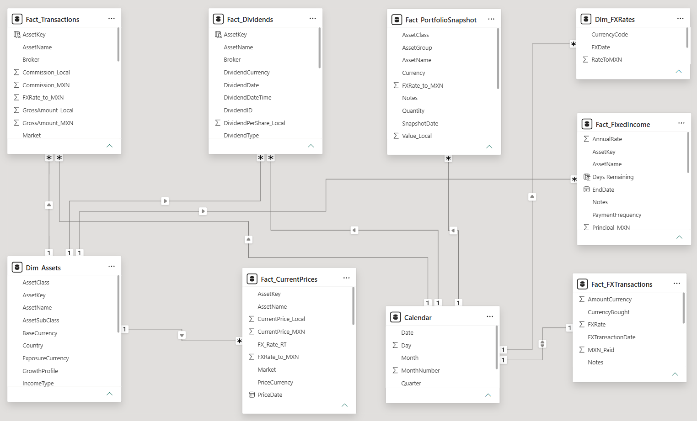
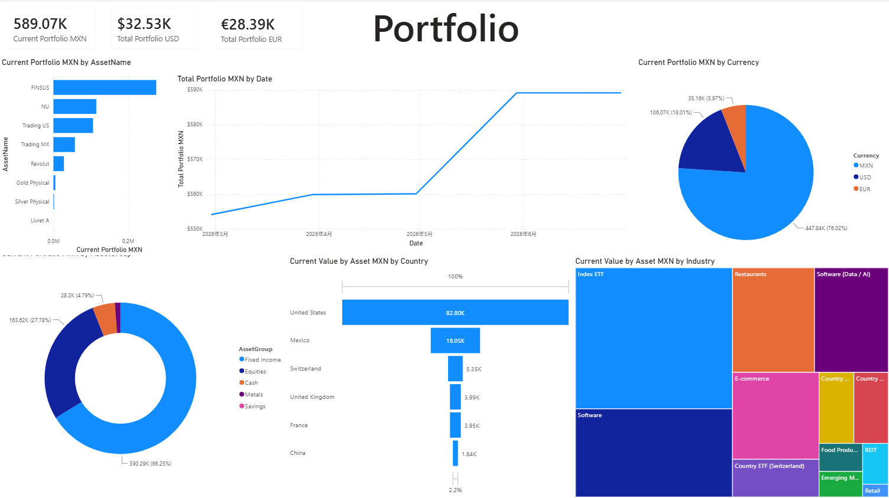

# Personal Investment Portfolio Dashboard — Power BI

## Overview
A personal-use Power BI dashboard to track a multi-asset, multi-currency 
investment portfolio across MXN, USD, and EUR.

## Data Model
Star schema with dimension and fact tables:

- **Dim_Assets** — asset metadata (name, group, sector, country, currency)
- **Dim_FXRates** — exchange rates for MXN/USD/EUR conversion
- **Calendar** — date dimension for time intelligence
- Fact tables: transactions, dividends, fees, portfolio snapshots

## Dashboard Pages

### 1. Portfolio Overview
Current portfolio value in MXN, USD, and EUR via dynamic DAX currency conversion.
Breakdown by asset group (Trading, Income, Fixed Income).

### 2. Asset Detail
Current value by asset name, sector, and country.

### 3. Transactions
Total buy/sell amounts, net invested capital, fees, and taxes.

Key measures: `Total Buy MXN`, `Total Sell MXN`, `Net Invested`, 
`Realized P&L`, `Average USD Cost FX`

### 4. Dividends
Total dividends received, dividend taxes, and active monthly income projection.

### 5. Fixed Income
Active principal, maturity status, next maturity date (in days), 
and monthly income historical trend.

## Key Technical Decisions
- All monetary values stored in local currency; DAX converts dynamically 
  using FX rates from `Dim_FXRates`
- `CALCULATE` + `FILTER` patterns used for period-specific aggregations
- Slicer-driven currency toggle affects all card and chart visuals

## Tools
Power BI Desktop · DAX · Power Query · Excel (data source)

## Author

**Salvador Jiménez-Juárez**
Mastrère Spécialisé – Digital Strategy Management, Grenoble École de Management (2025)
[LinkedIn](https://linkedin.com/in/salvador-jimenez97mx) · [Medium](https://medium.com/@salvador.jimenez-juarez)
